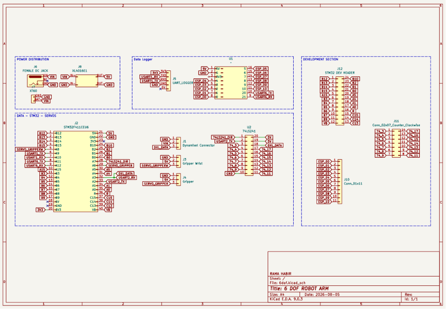
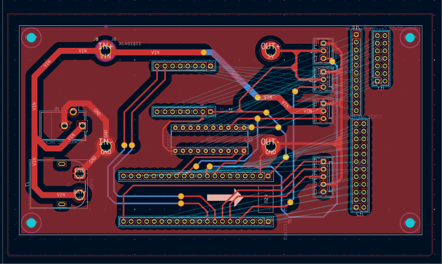
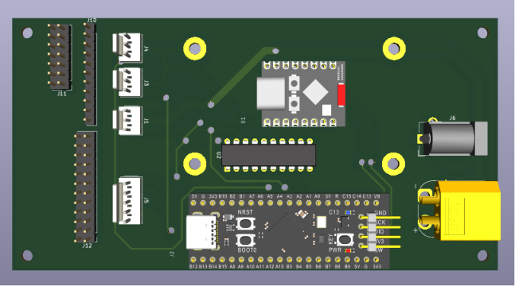
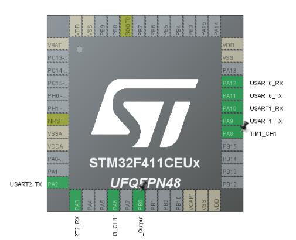

# STM32F411 6-DOF Robot Arm Controller

Firmware for a 6-degree-of-freedom robot arm based on an STM32F411CEU6 (Black Pill). The controller operates four Dynamixel joints over a half-duplex serial bus and provides PWM channels for the end effector.

The project uses STM32Cube HAL with PlatformIO and is uploaded through the USB-to-TTL serial adapter (upload protocol `serial`).

## System overview

- **4 × Dynamixel joints** — controlled through USART2 using Dynamixel Protocol 1.0
- **1 × wrist/gripper rotation servo** — PWM output on PA8 (TIM1_CH1, configured but not started)
- **1 × gripper servo** — PWM output on PA6 (TIM3_CH1)
- **USB-to-TTL data logger/telemetry** — connected through USART1 (PB6/PB7)
- **ESP32-C3 Super Mini** — planned wireless interface through USART6 (PA11/PA12)
- **74LS241 buffer** — converts the Dynamixel UART connection into a controlled half-duplex bus

## Hardware

- STM32F411CEU6 Black Pill development board
- Dynamixel AX-series actuators (the driver currently targets the AX-12A control table)
- 74LS241 tri-state buffer for the Dynamixel half-duplex bus
- Two PWM-compatible hobby servos
- USB-to-TTL serial adapter
- ESP32-C3 Super Mini (planned)
- Suitable external power supplies for the Dynamixel and hobby servos

## Controller PCB

The repository includes the editable KiCad source for the custom controller PCB. The board combines the STM32F411 Black Pill, ESP32-C3 Super Mini, 74LS241 Dynamixel interface, power input, actuator connectors, and development headers on one carrier board.

Open [`pcb/6dof.kicad_pro`](pcb/6dof.kicad_pro) in **KiCad 9.0 or newer** to view or modify the complete project.

### Schematic

<p align="center">
  
</p>

Editable source: [`pcb/6dof.kicad_sch`](pcb/6dof.kicad_sch)

### PCB layout

<p align="center">
  
</p>

Editable source: [`pcb/6dof.kicad_pcb`](pcb/6dof.kicad_pcb)

### 3D preview

<p align="center">
  
</p>

> The KiCad files are active design sources. Review the schematic, complete the design-rule checks, and verify all footprints and routing before ordering a PCB. Gerber files, drill files, and a bill of materials are not included yet.

## Pin assignment

<p align="center">
  
</p>

| Function | STM32 peripheral | Pin | Direction | Notes |
|---|---|---:|---|---|
| Dynamixel TX | USART2_TX | PA2 | Output | 1 Mbps, 8-N-1 |
| Dynamixel RX | USART2_RX | PA3 | Input | Receives Dynamixel status packets |
| 74LS241 direction | GPIO | PB0 | Output | High = transmit, low = receive/bus released |
| Data logger/telemetry TX | USART1_TX | PB6 | Output | 115200, 8-N-1; connect to USB-to-TTL RX |
| Data logger RX | USART1_RX | PB7 | Input | Connect to USB-to-TTL TX |
| ESP32-C3 TX | USART6_TX | PA11 | Output | 115200, 8-N-1; planned wireless link; connect to ESP32 RX |
| ESP32-C3 RX | USART6_RX | PA12 | Input | Planned wireless link; connect to ESP32 TX |
| Gripper rotation servo | TIM1_CH1 | PA8 | PWM output | Rotates the gripper (not started by default) |
| Gripper servo | TIM3_CH1 | PA6 | PWM output | Opens and closes the gripper |
| Built-in status LED | GPIO | PC13 | Output | Active-low on the Black Pill |

> The README pin table matches the generated firmware. If you target the earlier `PA9/PA10` USART1 design, update the alternate-function configuration in `src/usart.c` before wiring.

## Dynamixel bus

Dynamixel Protocol 1.0 uses a single bidirectional data wire. USART2 provides separate TX and RX signals, so the 74LS241 is used to control when the STM32 drives the bus.

```text
STM32 PA2 (USART2_TX) ──> 74LS241 input
STM32 PB0 (DIR)       ──> 74LS241 output-enable/direction control
74LS241 bus output    ──> Dynamixel DATA
STM32 PA3 (USART2_RX) <── Dynamixel DATA / receive path

STM32 GND ─────────────── Dynamixel interface GND
```

The firmware sets PB0 high while transmitting and returns it low before waiting for a servo response. USART2 is configured for **1,000,000 baud, 8 data bits, no parity, and 1 stop bit**.

Do not power the actuators from the STM32 board. Use correctly rated external supplies and connect the grounds of the STM32, servo supplies, Dynamixel bus, USB-to-TTL adapter, and ESP32 interface.

## Joint IDs

The current firmware polls the following joints. With torque off, move them by hand and verify the reported raw values change.

| Joint | Dynamixel ID | Notes |
|---|---:|---|
| Base | 1 | Home ≈ 512 |
| Shoulder | 9 | Home ≈ 315 |
| Elbow | 13 | Home ≈ 512 |
| Wrist | 3 | Home ≈ 512 |

For AX-series position control, raw values `0..1023` represent approximately `0..300°`:

```text
angle = raw_position × 300 / 1023
```

## Telemetry output

The firmware runs with **torque off** on all four joints. It reads present position, speed, load, voltage, temperature, and the moving flag for each joint, then prints one line to **both USART1 and USART6** (115200 baud, 8-N-1):

```text
BASE,826,0,0,124,32,IDL SHD,651,0,0,121,32,IDL ELB,557,0,0,124,32,IDL WRI,532,0,0,124,32,IDL
```

Each joint is separated by a space and contains comma-separated fields:

| Field | Meaning |
|---|---|
| `NAME` | Joint name (`BASE`, `SHD`, `ELB`, `WRI`) |
| `pos` | Present position, raw 0–1023 |
| `spd` | Present speed (0–1023); 0 = stationary |
| `load` | Present load, centered on 0 |
| `V` | Supply voltage in tenths of a volt (e.g. `124` = 12.4 V) |
| `T` | Servo board temperature in °C |
| `mov` | `IDL` = idle, `MOV` = rotating |

If a joint does not respond, that joint prints `NAME,ERROR,<code>` instead of numeric fields. On startup, USART1 also prints `Dynamixel ready (torque off)` once.

## Firmware status

Currently implemented:

- USART2 Dynamixel Protocol 1.0 communication at 1 Mbps, half-duplex direction control through PB0
- Ping, 8/16-bit read and write, torque, LED, goal-position, speed, present-position, present-speed, load, voltage, temperature, and moving-flag commands
- Packet validation for ID, length, checksum, timeout, and servo-reported errors
- Telemetry logging to USART1 (PB6/PB7) and USART6 (PA11/PA12) at 115200 baud
- Torque-off startup so joints can be moved by hand while powered
- TIM3 channel 1 PWM for PA6 (started); TIM1 channel 1 PWM for PA8 (configured, not started)

Still to be integrated into the active application:

- Enable torque and add coordinated motion control for the arm axes
- Start the TIM1 (PA8) gripper-rotation PWM channel
- Define the command protocol between the STM32 and ESP32-C3
- Optional data-fusion/feedback layer for closed-loop control

## Building and uploading

### Requirements

- [Visual Studio Code](https://code.visualstudio.com/) with the PlatformIO extension, or PlatformIO Core
- USB-to-TTL serial adapter
- External power supplies for the Dynamixel actuators

### PlatformIO commands

Build the firmware:

```sh
pio run
```

Upload over the serial adapter (the default `upload_protocol = serial` must match the connected adapter and bootloader):

```sh
pio run --target upload
```

Open the serial monitor on the USB-to-TTL adapter (e.g. `COM11`) for telemetry output:

```sh
pio device monitor --port COM11 --baud 115200
```

The PlatformIO environment is `genericSTM32F411CE`, using the STM32Cube framework and serial upload.

## Project structure

```text
.
├── include/
│   ├── dynamixel.h       # Dynamixel driver API and control-table addresses
│   ├── gpio.h
│   ├── main.h
│   ├── tim.h
│   └── usart.h
├── docs/
│   ├── 3dpcb.png         # Render of the assembled controller PCB
│   ├── pcb_footprint.png # PCB routing and footprint preview
│   ├── schematic.png     # Controller schematic preview
│   └── stm32pinout.png   # STM32 peripheral pin assignment
├── pcb/
│   ├── 6dof.kicad_pcb    # Editable PCB layout
│   ├── 6dof.kicad_pro    # KiCad project settings
│   └── 6dof.kicad_sch    # Editable schematic
├── src/
│   ├── dynamixel.c       # Protocol 1.0 packet transport and commands
│   ├── gpio.c            # LED and 74LS241 direction GPIO setup
│   ├── main.c            # Active test application
│   ├── tim.c             # PA8 and PA6 PWM timer configuration
│   └── usart.c           # USART1 and USART2 configuration
├── main_lama/            # Earlier application code kept for reference
└── platformio.ini        # PlatformIO target and build configuration
```

## Safety notes

- Test one actuator at a time before operating the complete arm.
- Verify Dynamixel IDs and baud rates before enabling torque.
- Keep the arm clear of people and objects during first motion tests.
- Use a current-limited actuator supply and provide an accessible emergency power cutoff.
- Set conservative position and speed limits in software to prevent mechanical collisions.
- Never connect 5 V logic directly to a non-5-V-tolerant STM32 input; verify the complete 74LS241 interface and supply arrangement before powering it.

## License

This project is open-source software available under the [MIT License](LICENSE).
